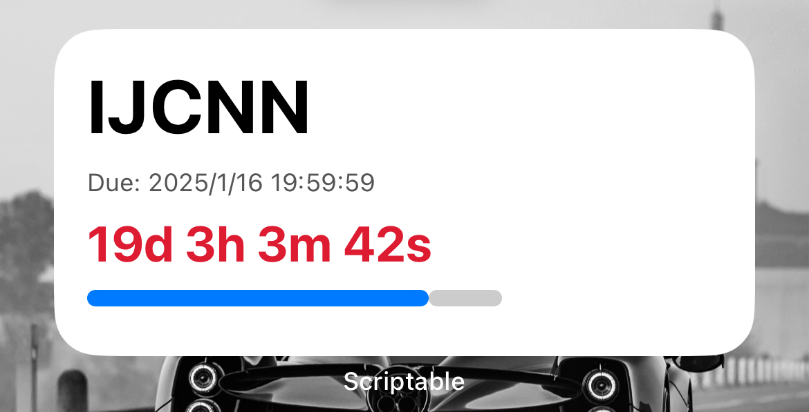
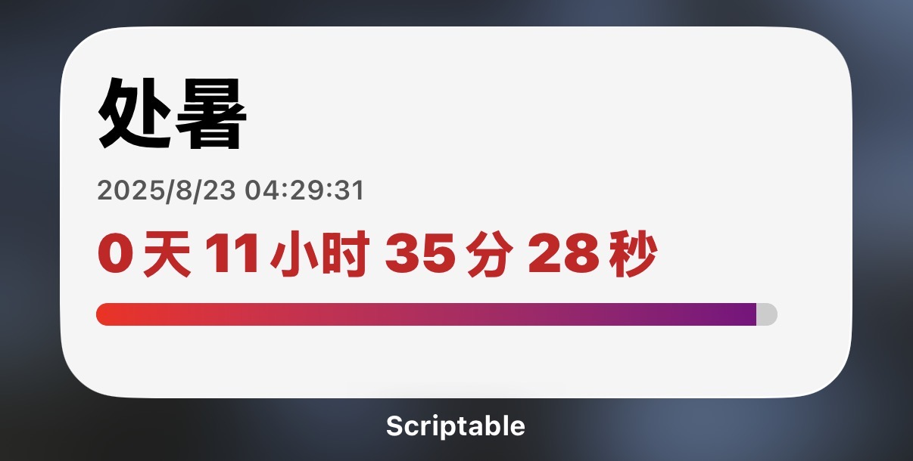

# Conference-Countdown-Widget

这是一个基于 `Scriptable` 以及 `JavaScript` 的开源项目，用于构建一个简单的倒计时小部件。自定义部分均在代码中提示，可自行修改。基本代码在 `Conference-Countdown.js` 中，目前新增一个 `24节气倒计时.js`，可以用来自动识别最近的节气并进行二十四节气倒计时。

如果实在懒得看怎么用 `Scriptable`，可以看此处 [tutorial](https://cuiem.github.io/posts/24/)。

Eng: This is an open source project based on `Scriptable` and `JavaScript` to build a simple conference paper submission deadline countdown widget. The customization part is indicated in the code, which can be modified by yourself. The basic code is in `Conference-Countdown.js`, and a new file `24节气倒计时.js` has been added, which can automatically recognize the nearest solar term and perform a countdown to the 24 solar terms.

If you are too lazy to see how to use `Scriptable`, you can see here [tutorial](https://cuiem.github.io/posts/24/).